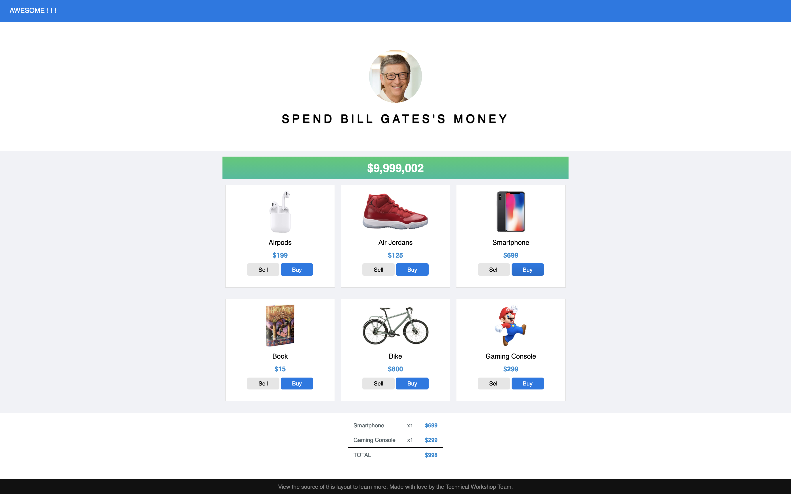
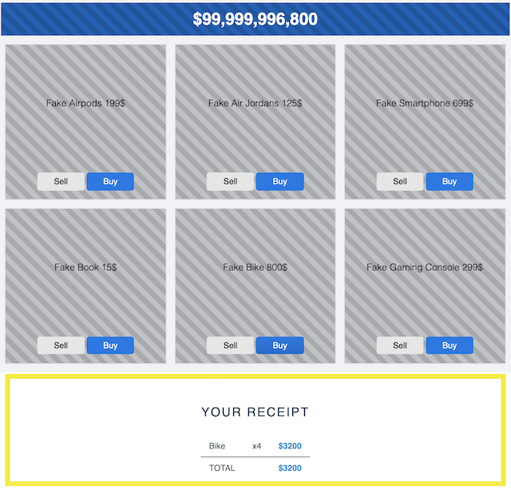
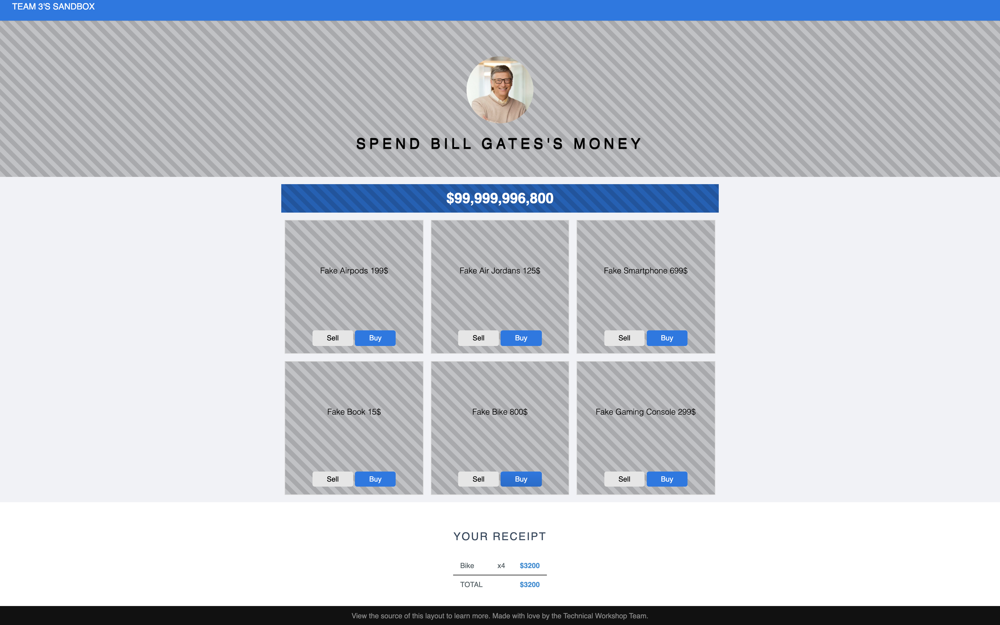

# micro-frontend-team-three
# Overall
Inspired by https://neal.fun/spend/


Bill Gates is one of billionaires in the world. He's very rich. He has a lot of money. For that reason, today we will together help him spent his money on our application.

The application we are going to build with ONE main features is sell / buy the product which will have some requirements:
1. Display Bill remaining money after _buy / sell_ some products.
2. Display a list of products, each product should have _buy / sell_ action.
3. Show and update the receipt on every _buy / sell_ action.

As the workshop organizer, we decide that we separate the application into multiple fragments.  
So that we can work indepently and the team do their fragment freely choose the framework they want.

## Team specific requirements
1. Build a fragment can display the receipt like this:
    * When _buy / sell_ is clicked, receipt must be updated (_with buy / sell action belong to team 2_).
    * When receipt total is changed, must update Bill remaining money (_with Bill remaining money belong to team 1_)
      

    __Hint__: Your team should produce a fragment within JS file. Application just import your JS and declare some thing like:  
    ```html
    <receipt></receipt>
    ```

2. Build a _sandbox page_ where other teams can test how your team fragment look like, how it behave.  
      
    __Hint__: Your team will mock fragments of other teams. (image above)